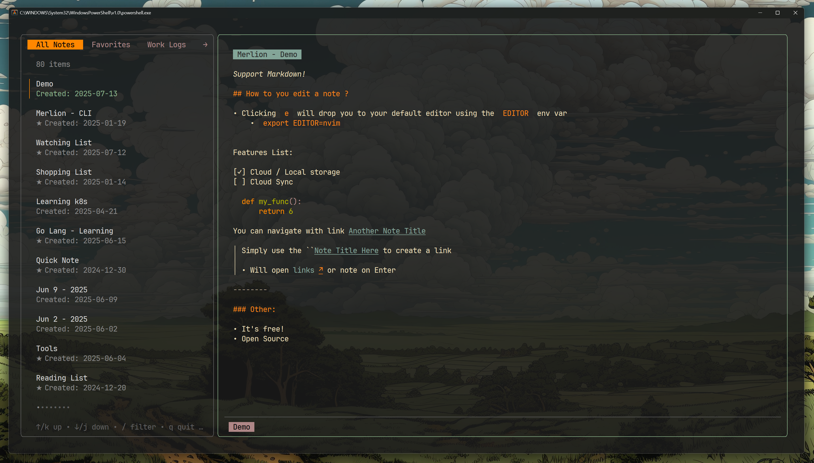
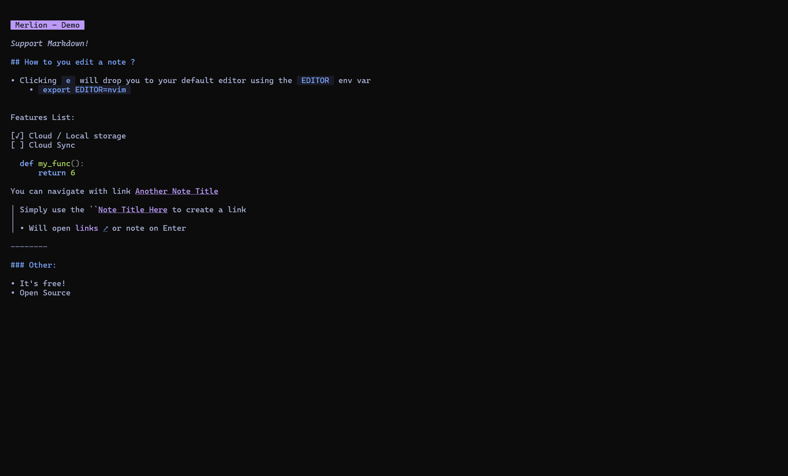
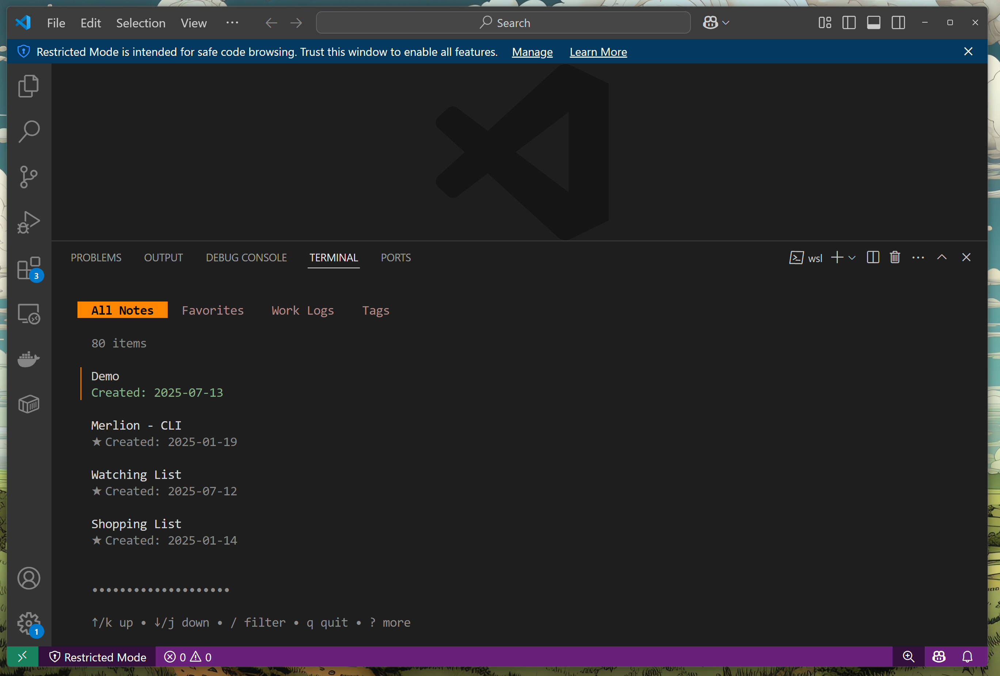

<h1 align="center">🌊 Merlion</h1>
<p align="center">
  Obsidian-inspired terminal note-taking app<br>
  <a href="https://merlion.dev">merlion.dev</a>
</p>

---

## What is it?

Merlion is a TUI, Markdown-based note-taking application, inspired by Obsidian but built for command-line workflows.

---

## Know more

Always a WIP, but already usable and stable for daily note-taking.

**Why did I create that ?**
> Why not?
> - I wanted to check out Go
> - I'm using it every day, no more `.md` everywhere
> - And work across multiple computers (**Primary motivation**)
---

## Sync and Accounts

Merlion works fully offline by default, no account needed, all files are on your computer in a SqliteDB.
- To have online note for sharing note across computer, you can create an account at [Merlion.dev](https://merlion.dev)
    - You note will then be local, or online, switch between the two workplace with `(` or `)`
    - Sync capability between online & offline note will soon be added

---

## Getting Started

1. Clone the repository  
2. Build the project:

```sh
just build
# Or:
go build -o merlion ./cmd/merlion


Run it:
```sh
./merlion
```

#### Features
- Keyboard (only) navigation
- Local-first note storage
- Optional cloud storage to sync notes across devices
  - Lightweight web UI
- Built-in themes: Gruvbox and NeoTokyo
  - **Feel free to submit a PR to add more themes**.
  - Toggle themes with ctrl+t
- Naviguate between note base on note title
- Markdown support
- Use your `$EDITOR` as note editor, perfect for vim/nvim user

#### Screenshots
<p align="center">    </p> 

#### Tmux Integration

Add the following to your .tmux.conf to launch Merlion in a popup window:

```.tmux.conf
bind C-m display-popup \
  -d "#{pane_current_path}" \
  -w 90% \
  -h 90% \
  -E "merlion --compact"
```
Then launch it with `<tmux-leader> + m`.

#### Cloud Code

The cloud backend is currently private.
Roadmap

#### Planned features:
- [ ] Full-text search
- [ ] End-to-end encrypted for Cloud note
- [ ] Sync your local notes to the cloud
